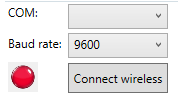
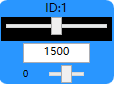
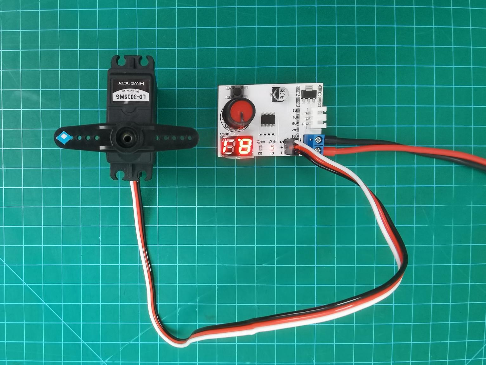
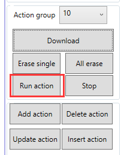

# 1. LSC-32 Servo Controller User Manual

## 1.1 Product Introduction

The 32-channel digital servo controller will bring you a good experience with its 11 features.

The CPU uses a high-performance STM32 microcontroller with an ARM Cortex-M3 core, which can control 32 servos with high precision and adjustable speed.

(1) Easy wiring. Servo controller has only anode and cathode power ports.

(2) User-friendly built-in switch.

(3) Support online debugging, no need to install drivers.

(4) 16M high-capacity memory, which is able to hold 230 action groups! Each action group can hold up to 510 actions.

(5) Low Voltage Alarm Switch Function: Switchable between 5V and 6.4V low voltage alarms.

(6) Support using PS2 handle and receiver. The remote control distance is about 10 meters.

(7) Support external expansion of MP3 modules and Bluetooth modules.

(8) Support two offline running modes, which can run once or loop offline.

(9) Serial communication support: Allows communicate with other microcontrollers for intelligent robot control.

(10) Equipped with 6-channel overload protection, prevent the servo from burning out.

## 1.2 Interface and Power Supply Instruction

### 1.2.1 Interface Instruction

| Interface/Button Name | Function |
|:---:|:---|
| 10-15 Channels over-current protection | 10-15 Channels servo control interface with over-current protection (K=1.5A, F=1A, H=500mA, C=200mA). |
| PS2 handle receiver interface | Connect the handle receiver and communicate with the handle. |
| Buzzer low voltage alarm | When the voltage is below 6.4V or 5V, the buzzer sounds an alarm. |
| Low voltage alarm switching interface | When the jumper is inserted, the low voltage alarm is set to 5V. When the jumper is removed, the low voltage alarm is set to 6.4V. |
| Secondary development communication interface | Used for serial communication between the controller and other development platforms. |
| LED1 & LED2 | LED1 power indicator: Lights up after power-on. LED2 communication indicator: Lights up when a signal is received. |
| Offline operation button | Press to run the 100th action group file offline. |
| Android interface | Connect the controller to PC. |
| 4-6 channels over-current protection | 4-6 Channels servo control interface with over-current protection (K=1.5A, F=1A, H=500mA, C=200mA). |
| USB interface | Connect the controller to PC. |
| MP3 module interface | Connect external MP3 module or Bluetooth module. |
| Power switch | Control the power connection of the controller. |
| Power interface | Lithium battery connection port (the power supply voltage is between 5-8.4V). |

### 1.2.2 Power Supply Instruction

The power supply interfaces on the 32-channel digital servo controller are shown below:

Its power supply voltage is between 5-8.4V. It can be powered by a 7.4 lithium battery.

:::{Note}
The supply voltage must not exceed 8.4V. If it exceeds 8.4V, it may damage the controller.
:::

Powered by a 7.4V lithium battery

The positive and negative terminals must be matched correctly.

## 1.3 PC Software Introduction

The servo and the servo arm used in this lesson are for demonstration only. Please rely on the actual situation.

### 1.3.1 Setup PC Software Control Environment

* **Setup Hardware Environment**

The required materials are shown below:

| Name | Qty |
|:---:|:---:|
| 32-channel servo controller | 1 |
| LD-3015MG servo | 1 |
| USB cable | 1 |
| Battery connection cable | 1 |
| 7.4V lithium battery | 1 |

(1) Connect the LD-3015MG servo to any servo port on the 32-channel servo controller. Let's take connecting to port 1 as an example. Connect the white wire to the **"S"** pin. The positive and negative terminals must be matched correctly.

(2) Connect the battery connection cable to the power interface on the servo controller, and connect the lithium battery.

:::{Note}
connect the red wire to `+`, and the black wire to `-`. The positive and negative terminals must be matched correctly.
:::

(3) Connect the servo controller to your PC with the USB cable. Switch the servo controller on.

* **Setup Software Environment**

Locate the **Hiwonder Servo Control Steup.exe** in [Appendix->04 PC Software](Appendix.md), and double-click to install it.

Install the software according to the installation prompts.

### 1.3.2 PC Software Interface Introduction

(1) Double-click  to open the PC software.

(2) The interface consists of six areas: ① Language and servo selection area, ② Device connection area, ③ Servo control area, ④ Action group details list, ⑤ Action group setting area, ⑥ Deviation setting area.

* **Language and servo selection**

Select the display language of the interface and the servo connected.

| Icon | Function Description |
|:---:|:---|
|  | Click the dropdown button on the right to select the display language of the interface.  |
|  | Servo selection area, all are checked by default. When in use, uncheck the servos that are not connected, and only keep the ones that are connected.  |
|  | Click to uncheck the currently selected servos. |
|  | Click to check the currently unselected servos. |

(1) Device connection area

In this area, you can connect the servo controller and check its connection status.

| Icon | Function Description |
|:---:|:---|
|  | Wired connection status button. After the controller is connected to the computer, the button turns green.  |
|  | For wireless connection, please refer to **"10.Wireless Bluetooth Control"**. COM: The connection port of the wireless Bluetooth debugging module (COM1 is the communication interface and should not be selected). Baud rate: When connecting wirelessly with Bluetooth, the baud rate needs to be set to 9600 (if 115200 is selected, communication will not be possible). Wireless connection: button for wireless connection status. After the control board is connected to the wireless Bluetooth debugging module, it turns green.  |

(2) Servo control area

You can change the corresponding servo values to adjust the rotation position of the servo.

| Icon | Function Description |
|:--:|:---|
|  | Interface number for the servo to be connected. |
|  | Used to adjust the angle position of the servo, with a value range of 500 to 2500. |
|  | Note: It is the small slider under the icon, used to adjust the servo deviation, with a value range of -100 to 100. To prevent misoperation, you need to click the **"Read Deviation"** button before dragging the deviation adjustment slider. For deviation adjustment, please refer to **"6.Servo Deviation Adjustment"**. |

(3) Action details list

Check the execution time and servo parameters of the action.

| Icon | Function Description |
|:---:|:---|
|  | Run the currently selected action. |
|  | Action number. |
|  | Action running time, which is the time it takes to execute the action. Unit: ms. |
|  | Servo parameter list. |
|  | #1: servo ID 1; P1500: The rotation position of servo ID 1. |

(4) Action group setting

Run, open, add, delete, modify, and view action groups and action group files.

| Icon | Function Description |
|:---:|:---|
|  | Click the dropdown button on the right to select the currently available action group. |
|  | Download the action group in the action details list to the servo controller for action group calling. |
|  | Delete the currently selected action group file and cannot be retrieved. |
|  | (Caution) Delete all action group files and cannot be retrieved. |
|  | Execute the selected action group once. |
|  | Stop the running action group. |
|  | Integrate the servo values in the current servo control area into an action, and add it to the last row of the action details list. |
|  | Delete the selected action in the action details list. |
|  | Replace the servo parameters of the selected action in the action details list with the current servo control area values, and replace the action execution time with the value set for **"Action Time"**. |
|  | Insert a new action group above the selected action group. |
|  | The time required to run a single action. It can be directly modified in the box. The unit is ms. |
|  | Click  to select and play music from your computer. |
|  | Execute the actions in the action details list once, and check **"Loop"** to execute the actions in a loop. |
|  | Open the specified action group file. |
|  | Integrate the actions in the action details list into an action group file, and save it to the specified location. |
|  | When the action details list is not empty, click the button to link the specified action group to the end of the list. |

(5) Deviation setting

The servo deviation can be set in this area. For specific operations on deviation adjustment, please refer to **"6. Servo Deviation Adjustment"**.

| Icon | Function Description |
|:--:|:---|
|  | Restore all servo parameters in the servo control area to 1500. |
|  | Read the current servo deviation value. |
|  | Save the adjusted servo deviation value to the controller. |
|  | Restore the servo deviation to 0. |

## 1.4 Online Computer Debugging

### 1.4.1 Install Serial Port Driver

:::{Note}
* Before using the PC software, please ensure that the computer has installed the CH341 serial port driver. Otherwise, it may affect its subsequent connection and use.
* If the CH341 serial port driver has been installed, you can skip this step.
:::

(1) Locate and open the **ch341ser.exe** serial port driver installation package in the [PC Software Installation Package](Appendix.md), and open it in the same directory as this section.

(2) Click the Install button, and then the Install and Uninstall buttons will turn gray. Wait a moment for the prompt of successful installation.

### 1.4.2 Servo Status Instruction

There are two methods for online computer debugging: wired connection debugging and wireless connection debugging. Let's briefly explain these two methods.

The debugging explanation is based on ID1 servo, and other ID servos are the same.

The three images represent the three basic positions of the servo (neutral position, minimum angle, and maximum angle). For demonstration, a servo arm is inserted as a reference (with the label on the right side of the servo arm as the initial position).

Neutral position: 135°servo angle, which is corresponding to the position of 1500

Minimum position: 0°servo angle, which is corresponding to the position of 500

Maximum position: 270°servo angle, which is corresponding to the position of 2500

### 1.4.3 Wired Connection Debugging

For Wired connection, the servo controller needs to be connected to the computer with a USB cable.

(1) Please refer to [1.3.1 Setup PC Software Control Environment](#anchor_1_3_1) to connect the servo controller and servo to the PC software. Check the box for servo 1. You can check based on the actual servo number.

(2) Click **"Reset servo"** to make the servo return to the neutral position, and the servo is at the 90° position.

:::{Note}
The servo will not automatically return to the neutral position immediately after power-on. Attempting to operate the servo directly via the panel may cause damage to the servo.
:::

(3) Drag the slider below the servo ID to make the servo rotate to 270° and 0° positions respectively.

<table class="" style="text-align: center;width: 600px;">
    <tbody>
    <tr>
        <td></td>
        <td></td>
    </tr>
    <tr>
        <td></td>
        <td></td>
    </tr>
    <tr>
        <td>270°servo angle, which is corresponding to the position of 2500</td>
        <td>0°servo angle, which is corresponding to the position of 500</td>
    </tr>
    </tbody>
</table>

### 1.4.4 Wireless Connection Debugging

:::{Note}
The wireless Bluetooth debugging module needs to be purchased separately.
:::

Wireless Bluetooth debugging: Connect the 32-channel controller to the wireless Bluetooth debugging module, and then connect the module to the PC software to control the servo rotation.

The specific connection method is as follows:

(1) Connect the servo to the controller and switch the controller on.

:::{Note}
The controller should be turned on before connecting the Bluetooth debugging module.
:::

(2) Connect the Bluetooth debugging module to the computer with USB cable. The two LED lights on the Bluetooth debugging module will flash blue. If the Bluetooth module on the controller is connected, the LEDs will remain blue.

(3) If the LED lights are still flashing after 50 seconds, press the **"DEL"** button on the Bluetooth debugging module.

(4) Wait for the Bluetooth connection. When the LED light on the Bluetooth debugging module is on, the connection is successful.

(5) Open the PC software and select the connected COM interface. Do not connect if it is COM1, as it is the system communication interface of the computer. Choose the baud rate of 9600. If you choose the baud rate of 115200, you cannot control it. The buzzer will also sound during control. Click **"Connect Wireless"**, and the status button will turn green when the connection is successful.

(6) Check the box for servo 1 (You can check it based on the actual situation).

(7) Please refer to [1.4.3 Wired Connection Debugging](#anchor_1_4_3) for debugging.

## 1.5 Edit and Call Action Group

### 1.5.1 Edit Action Group

Let's demonstrate on connecting a servo 1, and making it rotate left and right.

(1) Please refer to [1.3.1 Setup PC Software Control Environment](#anchor_1_3_1) to connect the servo to the PC software, and check the box for servo 1. For the selection of servos, please rely on the actual situation.

(2) Click **"Reset servo"** to make the servo in the neutral position.

(3) Set the action time to 1000ms, click **"Add Action"**. Add this action to the action details list.

(4) Then rotate the servo to the right. Set the action time to 1000ms, click **"Add Action"**, and add this action to the action details list.

(5) You can add a transition action between two actions to make the actions more naturally connected. Based on the previous action, keep the servo value unchanged. Directly modify the action time, generally between 100-300ms. Then click **"Add Action"** again.

(6) Return the servo to the neutral position, set the time to 1000ms. Click **"Add Action"**.

(7) Set the transition action. Set the time to 200ms, and click **"Add Action"**.

(8) Rotate the servo to the left. Set the time to 1000ms, and click **"Add Action"**.

(9) Set the transition action. Set the time to 200ms, and click **"Add Action"**.

(10) Next, return the servo to the neutral position. Set the time to 1000ms, and click **"Add Action"**.

(11) After the action editing is completed, click **"Save Action File"** to save the edited action group file to the local computer.

:::{Note}
The save path can be customized. For easy calling later, it is recommended to name the file as **"number+action group name"**. For example, **"No.10 action"**. When calling it later, you only need to input the action group number **"10"**.
:::

### 1.5.2 Call Action Group

After saving the action group, if you want to run the action group again, you can directly run it through the **"Online Run"** button, or run it by calling the **"Run action"** button in the action list. The method of calling the action group is as follows:

(1) Please refer to [1.3.1 Setup PC Software Control Environment](#anchor_1_3_1) to connect the servo to the PC software.

(2) Select an action group number in the dropdown list of the action group. Let's take No. 10 as an example. You can select it based on you own needs. No.100 is the action group for offline control. When using the offline function, the action group can be downloaded to 100.

(3) After selecting the action group number, click **"Download"** to download the actions in the action details list to the **"Action group"** number. When you hear a 'beep' sound from the buzzer, and a pop-up window appears on the page, it means that the download is completed.

(4) Click **"Run action"** to run the new No. 10 action group.

## 1.6 Servo Deviation Adjustment

The meshing of the servo shaft with the servo arm or servo horn is based on gears. Therefore, it's difficult to install the servo arm or servo horn to a specific position during installation. In this case, you can use the PC software to adjust the deviation of the servo to make it rotate to a specific position.

This section takes the example of adjusting the servo arm of servo 1 to a 90-degree position. The adjustment method for other servos is the same.

### 1.6.1 Getting Ready

Please refer to [1.3.1 Setup PC Software Control Environment](#anchor_1_3_1) to connect the servo controller and the servo to the PC. Select servo 1. The number can be checked based on the actual situation.

### 1.6.2 Deviation Judgment

* **If the servo returns to the neutral position as shown in the figure below, no adjustment is needed.**

(1) If the angle between the servo arm and the servo in the horizontal plane is less than 13 degrees, it can be adjusted to return to the neutral position via the PC software. It is a small deviation and can be adjusted based on [1.6.3 Small Deviation Adjustment](#anchor_1_6_3). The deviation is as follows:

(2) If the angle between the servo arm and the servo in the horizontal plane is greater than 13 degrees, it cannot be adjusted to return to the neutral position via the PC software. It is a large deviation and can be adjusted based on [1.6.4 Large Deviation Adjustment](#anchor_1_64). The deviation is as follows:

### 1.6.3 Small Deviation Adjustment

The small deviation can be directly adjusted by dragging the deviation slider of the servo on the PC software interface.

:::{Note}
The adjustable range is between -100 and 100. If the servo arm can be adjusted to be parallel to the servo in the horizontal plane within this range, it is a small deviation. If the adjustment range exceeds this range, it is a large deviation. Please refer to [1.6.4 Large Deviation Adjustment](#anchor_1_6_4) to adjust.
:::

(1) Please refer to [1.3.1 Setup PC Software Control Environment](#anchor_1_3_1) to connect the servo controller and the servo to the PC. Select servo 1. The number can be checked based on the actual situation.

(2) Click **"Reset servo"** to rotate the servo back to the neutral position.

(3) Click **"Read"** to read the deviation value of the current servo interface on the controller.

(4) Drag the slider shown below to keep the servo arm parallel to the servo in the horizontal plane.

(5) After adjusting, click **"Download"** to download the deviation value to the controller. If it is not downloaded, the adjustment is invalid.

### 1.6.4 Large Deviation Adjustment

For large deviation adjustment, the servo arm needs to be removed from the servo and returned to neutral position. Then, you can access the small deviation adjustment.

(1) Remove the shaft screw and then the servo arm.

 

(2) Open the servo controller, and click **"Reset servo"**.

(3) After the servo returns to the neutral position, close the controller. Install the servo arm parallel to the servo in the horizontal plane. Then, tighten the screw on main shaft .

(4) Open the controller, and refer to [1.6.3 Small Deviation Adjustment](#anchor_1_6_3) to adjust the servo.

## 1.7 Offline Control

The six-channel Bluetooth servo controller can not only run action groups online, but also offline with the onboard **"Run"** button. This lesson shows the action group **"No.10 Turn left and right"** running in [1.5 Edit and Call Action Group](#anchor_1_5).

The specific control method is as follows:

(1) Please refer to [1.3.1 Setup PC Software Control Environment](#anchor_1_3_1) to connect the servo controller and servo to the PC software.

(2) Click **"Open action file"** to open the action group **"No. 10 Turn left and right"**.

 

(3) Select the **"Action group"** as No.100, and click **"Download"**. Once the buzzer makes a sound, it is successfully downloaded.

(4) Press the **"Run"** button on the controller to run the action group offline.

## 1.8 Handle Control

### 1.8.1 Getting Ready

The required accessories for handle control is shown below:

| Name | Qty |
|:---:|:---:|
| 32-channel servo controller | 1 |
| LD-3015MG servo (with servo cable) | 1 |
| Battery connection cable | 1 |
| 7.4V lithium battery | 1 |
| PS2 handle (please prepare two 7th grade batteries) | 1 |
| PS2 handle receiver | 1 |

(1) Remove the back cover of the PS2 handle, and insert the 7th grade batteries into the battery slot. The positive and negative terminals must be matched correctly.

(2) Connect the LD-3015MG servo to any servo port on the 32-channel servo controller, with white wire to **"S"** pin.

(3) Connect the controller to the PS2 handle receiver.

### 1.8.2 Device Connection

(1) Turn on the controller.

(2) Turn on the PS2 handle. The two LED lights (red and green) on the controller will flash simultaneously.

(3) Wait a few seconds for the controller and the PS2 controller to automatically pair. When the pairing is successful, the red and green LEDs will stay on. If only a single green or red light is on after turning on the controller, press the MODE button.

(4) If the connection is not successful, please turn off the robotic arm and PS2 handle, and repeat the above steps.

:::{Note}
If the PS2 handle is not connected to the robotic arm within 30 seconds after turning on the PS2 handle, or if there is no operation on the PS2 handle within 5 minutes after connection, the PS2 controller will enter sleep mode. Please press the **"START"** button to wake up the PS2 handle.
:::

### 1.8.3 Mode Introduction

The PS2 handle has two modes for controlling the servo: action group mode and single servo mode. After the PS2 controller is successfully connected, it defaults to action group mode.

Single servo mode: You can control a single servo to rotate forward or backward by pressing the buttons on the PS2 controller.

Action group mode: You can control the servo to perform corresponding actions by pressing the buttons on the PS2 controller.

Switching between the two modes: Press the **"SELECT"** button and the **"START"** button. When you hear the prompt tone, the switch is successful. Switching from single servo mode to action group mode: one beep; switching from action group mode to single servo mode: two beeps.

### 1.8.4 Button Instruction

* **Button instruction in single servo mode**

The following is the button instruction in single servo mode:

Press the **"START"** button in single servo mode. The servo will return to the neutral position.

:::{Note}
After the servo rotates to the limit position, please rotate it in the opposite direction. Otherwise, it may cause the servo to be stuck and burned out.
:::

Button instruction in action group mode

The button instruction in action group mode is as follows:

For the combination button, please press and hold SELECT, and then press the corresponding button.

| Button | Function |
|:---:|:---:|
| START | Press to run action 0. |
| **↑** | Press to run action group 1 once. |
| **↓** | Press to run action group 2 once. |
| **←** | Press to run action group 3 once. |
| **→** | Press to run action group 4 once. |
| **△** | Press to run action group 5 once. |
| **×** | Press to run action group 6 once. |
| **◻** | Press to run action group 7 once. |
| **○** | Press to run action group 8 once. |
| **L1** | Press to run action group 9 once. |
| **R1** | Press to run action group 10 once. |
| **L2** | Press to run action group 10 once. |
| **R2** | Press to run action group 12 once. |
| **SELECT+△** | Press to run action group 13 once. |
| **SELECT+×** | Press to run action group 14 once. |
| **SELECT+◻** | Press to run action group 15 once. |
| **SELECT+○** | Press to run action group 16 once. |
| **SELECT+L1** | Press to run action group 17 once. |
| **SELECT+R1** | Press to run action group 18 once. |

## 1.9 APP Control

There are two control modes for the app. One is the global mode, and the other is the single mode. The global mode can control multiple servos simultaneously. The single mode can select a single servo for individual control. The specific control methods are follows.

### 1.9.1 App Installation

iOS user: Please search and download [ServoControl](https://apps.apple.com/us/app/learm/id1192117647) in the App Store.

Android user: Please locate the **PWM Servo-V1.0.1.apk** installation package in [Appendix->PWM Servo](Appendix.md), and install it on your phone.

### 1.9.2 Device Connection

:::{Note}
* Before using the app, please turn on Bluetooth and location services in your phone settings.
* Please pair and connect the device through the Bluetooth button in the app. Do not pair through the key in the phone settings.
* System requirements: Android 7.0 or above. iOS 9.1 or above.
* This section uses the Android version of the app as an example. It is applicable to iOS version.
:::

(1) Open the app. Its main interface shows two modes: global mode and single mode.

(2) The connection method for global mode and single point mode is the same. The interface for global mode is shown below. Click  in the upper right corner to open the device search list. Wait for a moment and select **"Hiwonder"** in the device list that appears.

(3) After successfully connected, the Bluetooth icon will remain on.

### 1.9.3 Global Mode Interface Introduction

(1) Servo Control Area: Drag the slider or click the buttons on both sides to control the angle of servo rotation.

(2) Menu Bar:

|  | Call the downloaded action group files in the controller |
|:--:|:---|
|  | Reset all servos to position 500 |
|  | Display app version and other information |
|  | Display Bluetooth connection and connection status |
|  | Call the downloaded action group files in the controller |

### 1.9.4 Single Mode Interface Introduction

(1) Servo Selection Area: Select the corresponding servo interface, and control the servo rotation by the bottom slider.

(2) Servo Control Area: Slide the slider to control the angle of servo rotation.

(3) Menu Bar:

| Icon | Function Description |
|:--:|:---|
|  | Call the downloaded action group files in the controller |
|  | Reset all servos to position 500 |
|  | Display app version and other information |
|  | Display Bluetooth connection and connection status |

## 1.10 Specification

| Working voltage | 5~8.4V |
|:--:|:--:|
| Dimension | 65mm*50mm |
| Mounting hole distance | 54mm*44mm |
| weight | About 26g |
| USB control | Support |
| PS2 handle control | Support |
| Maximum number of controlled servos | 32 |
| Storage space | 16M |
| Servo interface voltage | Consistent with working voltage (5-8.4V) |
| Signal isolation protection | Support |
| External Arduino, C51, STM32, esp32, Raspberry Pi (secondary development) | Support |
| Low voltage alarm | Support |
| Built-in switch | Support |
| Over-current protection (1.5A) | Support |
| External Bluetooth module | Support |
| External MP3 module | Support |