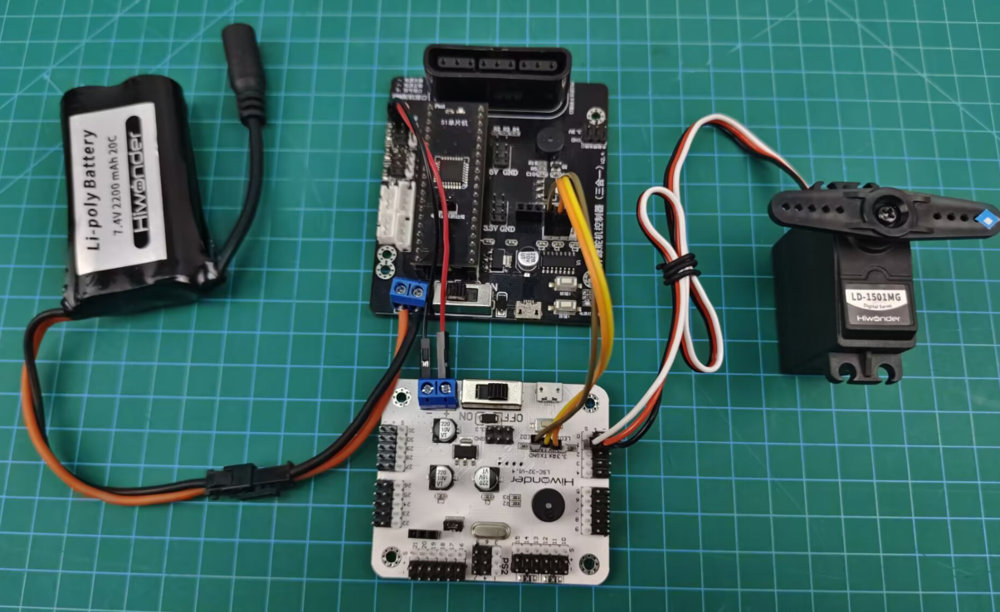
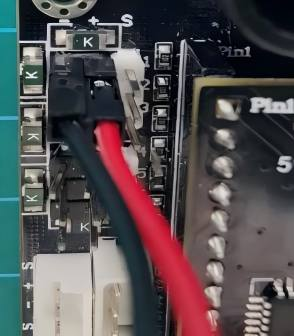
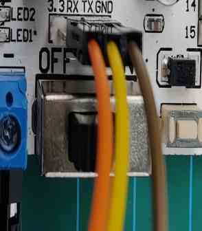
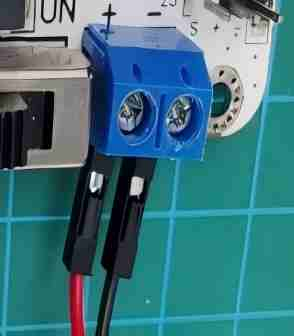

# 4. LSC-32 Controller Secondary Development-C51 Development

## 4.1 Getting Started

### 4.1.1 Wiring Instruction

This section employs an open-source servo controller, a STC15W4K32S4 microcontroller, and a 32-Channel Servo Controller for development, powered by a 7.4V 2200mAh lithium battery. Connect the serial port of the 32-Channel Servo Controller to the serial port of the open-source servo controller. The wiring is shown in the table and diagram below:



:::{Note}
* When wiring, connect the power supply to the open-source servo controller. Power the 32-channel servo controller by connecting the servo port on the open-source servo controller to the power input on the 32-ch servo controller. Make sure to connect the servo interface "**+**" to the power supply "**+**", and servo interface "**-**" to power supply "**-**". **Do not reverse the polarity, and do not plug the power cable directly into the servo ports on the 36-ch servo controller.**
* For serial connections, connect the `RX` pin of the open-source servo controller to the `TX` pin of the 32-channel servo controller. Connect the `TX` pin of the open-source board to the `RX` pin of the 36-channel controller, and connect `GND` to `GND`.
:::







The pin wiring method is shown in the table below:

| 32-ch servo controller | Picture for 32-ch servo controller | Open-source servo controller | Picture for open-source servo controller |
| :--- | :--- | :--- | :--- |
| RX |  | TX |  |
| TX | | RX | |
| GND | | GND | |
| Power Input + |  | Servo Interface + |  |
| Power Input - | | Servo Interface - | |

:::{Note}
* When using Hiwonder's lithium battery, connect the battery cable with the red wire to the positive (+) terminal and the black wire to the negative (–) terminal of the DC port.
* Before connecting the battery cables, make sure they are not already attached to the lithium battery. This prevents the risk of a short circuit caused by accidental contact between the positive and negative wires.
* When connecting the serial ports, make sure to cross the `RX` and `TX` pins. As shown in the two diagrams above.
* Before powering on, ensure that no metal objects are touching the controller. Otherwise, the exposed pins at the bottom of the board may cause a short circuit and damage the controller.
:::

### 4.1.2 Environment Configuration

Install `Keil4` software on PC. The software package is stored in [Appendix->C51 Software](Appendix.md). For the detailed operations of `Keil4`, please refer to the relevant tutorials.

## 4.2 Development Case

### 4.2.1 Case 1 Control PWM Servo Movement

In this example, the serial port is used to send instructions to the 32-ch servo controller, which then controls the servo to move.

* **Run Program**

Open the STC-ISP download tool in [Appendix->C51 Software](Appendix.md):


The STC-ISP configuration is shown as follow:


Click **"Open Code File"** and find the hex file in [**"C51 Program/Case 1 Control PWM Servo Movement/LobotServoTurn_C51/OBJ"**](../_static/source_code/C51_Development.zip).


After opening the program file, click **"Download/Program"** to upload the code to the 51 microcontroller. **Note:** Before uploading, remove the jumper cap from the 51 microcontroller. Once the STC-ISP tool in the lower-right corner shows that it is detecting the target device, reinsert the jumper cap. The upload process will begin automatically.


Once the upload is complete, turn on the 32-ch servo controller's power switch, and Servo ID 1 will start moving.

* **Project Outcome**

After running the program, the servo will continuously swing back and forth between position 500 and position 2500, with a 1.5-second interval.

* **Program Brief Analysis**

[Source Code](../_static/source_code/C51_Development.zip)

(1) Import Necessary Libraries

Import the package in `main.c` program:

{lineno-start=1}
```c
#include "include.h"
#include "lsc2d.h"
```
Import the package in `include.h` file:

{lineno-start=1}
```c
#include "include.h"
```
The library includes the necessary modules for communicating with the 32-ch servo controller. You can use the predefined variables and functions in it to control the servo.

(2) UART Initialization

{lineno-start=3}
```c
void InitUart(void)
{
	SCON = 0x50;
	AUXR = 0x16;
	AUXR |= 0x01;
	IE2 = 0x10;
	T2L = (65536 - (FOSC/4/UART4_BAUD));    
  T2H = (65536 - (FOSC/4/UART4_BAUD))>>8;

}
```
In the `uart.c` file, initialize the UART by enabling UART1 through the `SCON` register. The `AUCR` and `IE2` registers are configured so that UART1 uses `Timer 2` to generate the baud rate. Set the initial count values of `T2L` and `T2H` to configure the baud rate to 9600.

(3) Control Servo Movement

{lineno-start=}
```c
int main(void)
{
	InitUart();
	EA = 1;
	
	while(1)
	{
		moveServo(1, 500, 800);	 
		DelayMs(1500);	 
		
		moveServo(1, 2500, 800);	 
		DelayMs(1500);
		
	}

}
```
Before running the main program, call the `InitUart()` function to initialize the UART. Then, use functions from the `lsc2d.c` file to send data to the 32-ch servo controller and control the servo's movement.

### 4.2.2 Case 2 Control PWM Servo Speed

In this example, the serial port is used to send instructions to the 32-ch servo controller, which then controls the servo to move.

* **Run Program**

Open the STC-ISP download tool in [Appendix->C51 Software](Appendix.md):


The STC-ISP configuration is shown as follow:


Click **"Open Code File"** and find the hex file in [**"C51 Program/Case 2 Control PWM Servo Speed/LobotServoSpeed_C51/OBJ"**](../_static/source_code/C51_Development.zip).


After opening the program file, click **"Download/Program"** to upload the code to the 51 microcontroller. **Note:** Before uploading, remove the jumper cap from the 51 microcontroller. Once the STC-ISP tool in the lower-right corner shows that it is detecting the target device, reinsert the jumper cap. The upload process will begin automatically.


Once the upload is complete, turn on the 32-ch servo controller's power switch, and Servo ID 1 will start moving.

* **Project Outcome**

After running the program, the servo will rotate from position 500 to position 2500 at a speed set to 800 ms, and then rotate back from position 2500 to position 500 at a speed set to 1200 ms.

* **Program Brief Analysis**

[Source Code](../_static/source_code/C51_Development.zip)

(1) Import Necessary Libraries

Import the package in `main.c` program:

{lineno-start=1}
```c
#include "include.h"
#include "lsc2d.h"
```

Import the package in `include.h` file:

{lineno-start=1}
```c
#include "include.h"
```

The library includes the necessary modules for communicating with the 32-ch servo controller. You can use the predefined variables and functions in it to control the servo.

(2) UART Initialization

{lineno-start=3}
```c
void InitUart(void)
{
	SCON = 0x50;
	AUXR = 0x16;
	AUXR |= 0x01;
	IE2 = 0x10;
	T2L = (65536 - (FOSC/4/UART4_BAUD));    
  T2H = (65536 - (FOSC/4/UART4_BAUD))>>8;

}
```

In the `uart.c` file, initialize the UART by enabling UART1 through the `SCON` register. The `AUCR` and `IE2` registers are configured so that UART1 uses `Timer 2` to generate the baud rate. Set the initial count values of `T2L` and `T2H` to configure the baud rate to 9600.

(3) Main Program

{lineno-start=22}
```c
int main(void)
{
	InitUart();
	EA = 1;
	
	while(1)
	{

		moveServo(1, 500, 800);	 
		DelayMs(1500);
		
		moveServo(1, 2500, 800);	 
		DelayMs(1500);
		
		moveServo(1, 500, 1200);	 
		DelayMs(1500);
		
		moveServo(1, 2500, 1200);	 
		DelayMs(1500);
		
	}

}
```

Before running the main program, call the `InitUart()` function to initialize the UART. Then, use functions from the `lsc2d.c` file to send data to the 32-ch servo controller, enabling the servos to rotate at different speeds.

### 4.2.3 Case 3 Control Multiple Servos

In this example, the serial port is used to send instructions to the 32-ch servo controller, which then controls multiple servos to move.

* **Run Program**

Open the STC-ISP download tool in [Appendix->C51 Software](Appendix.md):


The STC-ISP configuration is shown as follow:


Click **"Open Code File"** and find the hex file in [C51 Development/Source Code/Case 3 Control Multiple Servos/OBJ/LobotServosTurn_C51](../_static/source_code/C51_Development.zip).


After opening the program file, click **"Download/Program"** to upload the code to the 51 microcontroller. **Note:** Before uploading, remove the jumper cap from the 51 microcontroller. Once the STC-ISP tool in the lower-right corner shows that it is detecting the target device, reinsert the jumper cap. The upload process will begin automatically.


* **Project Outcome**

After running the program, Servo 1 and Servo 2 will move back and forth between position 500 and position 2500, with an interval of 1.5 seconds. The number of servos you can control depends on the available ports on the controller. In this example, only two servos are used, but you can modify the code to control more servos.

* **Program Brief Analysis**

[Source Code](../_static/source_code/C51_Development.zip)

(1) Import Necessary Libraries

Import the package in `main.c` program:

{lineno-start=1}
```c
#include "include.h"
#include "lsc2d.h"
```
Import the package in `include.h` file:

{lineno-start=1}
```c
#include "include.h"
```
The library includes the necessary modules for communicating with the 32-ch servo controller. You can use the predefined variables and functions in it to control the servo.

(2) UART Initialization

{lineno-start=3}
```c
void InitUart(void)
{
	SCON = 0x50;
	S4CON = 0x10;		 
	AUXR = 0x16;
	AUXR |= 0x01;
	IE2 = 0x10;
	T2L = (65536 - (FOSC/4/UART4_BAUD));   
  T2H = (65536 - (FOSC/4/UART4_BAUD))>>8;

}
```

In the `uart.c` file, initialize the UART by enabling UART1 through the `SCON` register. The `AUCR` and `IE2` registers are configured so that UART1 uses `Timer 2` to generate the baud rate. Set the initial count values of `T2L` and `T2H` to configure the baud rate to 9600.

(3) Define Servo Structure

{lineno-start=22}
```c
LobotServo servos[3];		
```

Store the servos to be controlled and their related information in the `LobotServo` structure, which is mainly used for controlling multiple servos.

(4) Control Servo Movement

{lineno-start=22}
```c
LobotServo servos[3];		 

int main(void)
{
	InitUart();
	EA = 1;
	
	servos[0].ID = 1;			 
	servos[1].ID = 2;
	servos[2].ID = 3;
	
	while(1)
	{
		servos[0].Position = 500;		 
		servos[1].Position = 500;
		servos[2].Position = 500;
		
		moveServosByArray(servos, 3, 800);		 
		DelayMs(1500);
		
		servos[0].Position = 2500;		 
		servos[1].Position = 2500;
		servos[2].Position = 2500;
		
		moveServosByArray(servos, 3, 800);	 
		DelayMs(1500);
		
	}

}
```

The servo information stored in the structure is sent to the 32-ch servo controller via the serial port. The controller parses the received commands and moves each corresponding servo to its specified position.

### 4.2.4 Case 4 Central Position & Deviation Adjustment

In this example, the serial port is used to send instructions to the 32-ch servo controller, which then controls the servo to move to central position and deviation position.

The central position is considered the initial position of the servo and serves as the zero point for rotating in both positive and negative directions. Therefore, the servo should be adjusted to its central position before attaching the servo horn.

Servo deviation is caused by the spacing of the splines on the servo arm—a mechanical limitation that can be corrected through software. In robotics, if this deviation is not addressed, it may restrict the movement of the robot and negatively impact certain motion behaviors.

* **Run Program**

Open the STC-ISP download tool in [Appendix->C51 Software](Appendix.md):


The STC-ISP configuration is shown as follow:


Click **"Open Code File"** and find the hex file in ["**C51 Program/Case 4 Central Position & Deviation Adjustment/LobotServosDeviation_C51/OBJ**"](../_static/source_code/C51_Development.zip).


After opening the program file, click **"Download/Program"** to upload the code to the 51 microcontroller. **Note:** Before uploading, remove the jumper cap from the 51 microcontroller. Once the STC-ISP tool in the lower-right corner shows that it is detecting the target device, reinsert the jumper cap. The upload process will begin automatically.


* **Project Outcome**

The servo first returns to the central position. After a short delay, it rotates to the specified deviation angle and holds that position.

* **Program Brief Analysis**

[Source Code](../_static/source_code/C51_Development.zip)

(1) Import Necessary Libraries

Import the package in `main.c` program:

{lineno-start=1}
```c
#include "include.h"
#include "lsc2d.h"
```

Import the package in `include.h` file:

{lineno-start=1}
```c
#include "include.h"
```

The library includes the necessary modules for communicating with the 32-ch servo controller. You can use the predefined variables and functions in it to control the servo.

(2) UART Initialization

{lineno-start=}
```c
void InitUart(void)
{
	SCON = 0x50;
	AUXR = 0x16;
	AUXR |= 0x01;
	IE2 = 0x10;
	T2L = (65536 - (FOSC/4/UART4_BAUD));   
    T2H = (65536 - (FOSC/4/UART4_BAUD))>>8;

}
```

In the `uart.c` file, initialize the UART by enabling UART1 through the `SCON` register. The `AUCR` and `IE2` registers are configured so that UART1 uses `Timer 2` to generate the baud rate. Set the initial count values of `T2L` and `T2H` to configure the baud rate to 9600.

(3) Control Servo Movement

{lineno-start=22}
```c
uint8 deviation;	 

int main(void)
{
	InitUart();
	EA = 1;
	
	while(1)
	{
		moveServo(1, 1500, 500);	 
		DelayMs(2000);	 
		deviation = 200;
		moveServo(1, 1500+deviation, 200);	 
		
		while(1);
		
	}

}
```

Before the main program runs, define the servo deviation. First, move the servo to its central position and hold for 2 seconds. Then, based on this central position, apply an additional deviation to move the servo to the new target position, and keep it at this deviation angle.