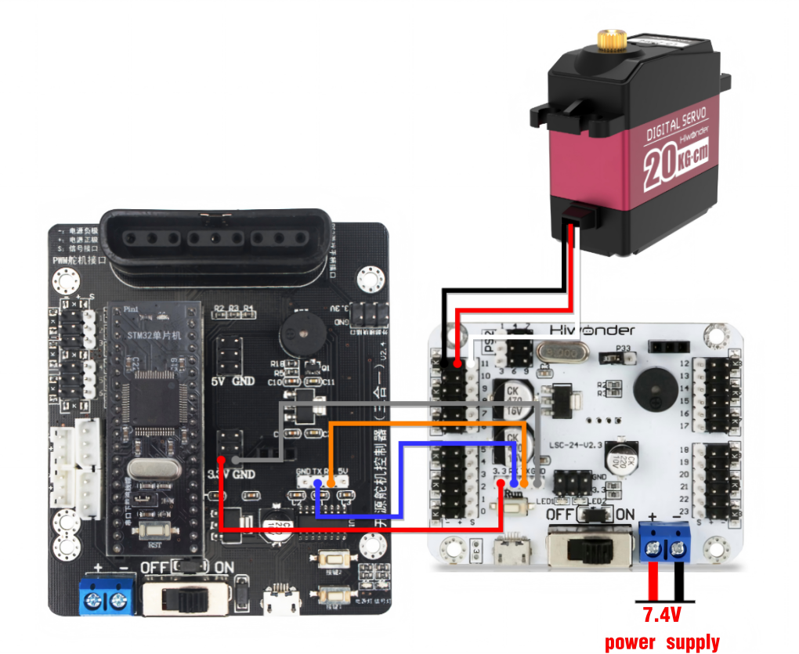

# 5. LSC-32 Controller Secondary Development-STM32 Development

## 5.1 Getting Ready

### 5.1.1 Wiring Instruction

This section employs the STM32 controller based on `STC15W4K32S4` and a 32-channel servo controller for development, powered by a 7.4V lithium battery. Connect the serial ports of the servo controller and the STM32 controller.



:::{Note}
* The servo wiring shown above is for illustrative purposes only. For specific connection interfaces, please refer to the following text.
* When using our lithium battery, connect the lithium battery interface wire with red to positive (+) and black to negative (-) to the DC port.
* If the interface wire is not connected to the lithium battery, do not directly connect it to the battery interface wire to avoid a short circuit between positive and negative poles, which may cause a short circuit.
* When connecting the serial ports, the RX and TX pins should be reversed. Please refer to the images above.
:::

### 5.1.2 Environment Configuration

Install `Keil5` software on PC. The software package is stored in [Appendix -> STM32 Software](Appendix.md). For the detailed operations of `Keil5`, please refer to the relevant tutorials.

## 5.2 Development Case

### 5.2.1 Case 1 Single Servo Rotation Control

In this case, commands are sent from the serial port to the servo controller, which then controls the servo rotation.

* **Run Program**

Open the  download tool in [2. Software&gt;STM32 Software](Appendix.md).


Configure it as shown in the figure:


Click . Locate and open the hex file stored in [STM32 Development/Case 1 Single Servo Rotation Control/PROJECT/OPT](https://drive.google.com/drive/folders/16Ftm18kJETFp2c_CMhh-ahgmghgYnKOR?usp=sharing).


After opening the program, click **"Start ISP"** to download the program to the STM32 microcontroller.

:::{Note}
When downloading the program, remove the jumper cap on the STM32 microcontroller and press the reset button. When the prompt **"Mission Complete, Anything OK"** appears in the lower right corner, it is successfully downloaded. Next, insert the jumper cap back into the STM32 microcontroller.
:::


After the download is completed, switch the servo controller on. Press the reset button on the STM32 microcontroller. The servo 1 will start to rotate.

* **Program Outcome**

After running the program, the servo 1 will continuously rotate between the positions of 500 and 2500, with an interval of 1.2 seconds.

* **Program Analysis**

[Source Code](https://drive.google.com/drive/folders/16Ftm18kJETFp2c_CMhh-ahgmghgYnKOR?usp=sharing)

(1) Import the Required Function Package

Import the function package in `main.c` program. The function package mainly encapsulates various function modules for the servo controller communication. The variables and functions defined in it can be used to control the servos.

{lineno-start=1}
```python
#include "delay.h"
#include "uart.h"
#include "LobotServoController.h"
#include "bool.h"
```

In the `main.c` file, a delay function is used for delaying in units of seconds (s).

{lineno-start=6}
```python
void delay_s(int s)
{
	for(;s>0;s--)
		delay_ms(1000);
}
```

(2) Initialize Serial Port

In the `uart.c` file, initialize the serial port. Configure `PA9` as the `TX` pin for outputting data, and `PA10` as the `RX` pin for reading data. The `USART` should be configured with 8 data bits, 1 stop bit, no parity, no flow control, and in read/write mode.

{lineno-start=39}
```python
void uartInit(u32 bound)
{
	GPIO_InitTypeDef GPIO_InitStructure;
	USART_InitTypeDef USART_InitStructure;

	RCC_APB2PeriphClockCmd(RCC_APB2Periph_USART1 | RCC_APB2Periph_GPIOA | RCC_APB2Periph_AFIO, ENABLE);
	
	//USART1_TX   PA9
	GPIO_InitStructure.GPIO_Pin = GPIO_Pin_9;
	GPIO_InitStructure.GPIO_Speed = GPIO_Speed_50MHz;
	GPIO_InitStructure.GPIO_Mode = GPIO_Mode_AF_PP;
	GPIO_Init(GPIOA, &GPIO_InitStructure);
	
	//USART1_RX	  PA10
	GPIO_InitStructure.GPIO_Pin = GPIO_Pin_10;
	GPIO_InitStructure.GPIO_Mode = GPIO_Mode_IN_FLOATING;
	GPIO_Init(GPIOA, &GPIO_InitStructure);

	 
	USART_InitStructure.USART_BaudRate = bound; 
	USART_InitStructure.USART_WordLength = USART_WordLength_8b;  
	USART_InitStructure.USART_StopBits = USART_StopBits_1;  
	USART_InitStructure.USART_Parity = USART_Parity_No;  
	USART_InitStructure.USART_HardwareFlowControl = USART_HardwareFlowControl_None;  
	USART_InitStructure.USART_Mode = USART_Mode_Rx | USART_Mode_Tx;  
	USART_Init(USART1, &USART_InitStructure);
	uartNVICInit();
	USART_ITConfig(USART1, USART_IT_RXNE, ENABLE);
	USART_Cmd(USART1, ENABLE);
}
```

(3) Servo Rotation Control

Before running the main program, call the `SystemInit()` function to initialize the system clock. Call the `delay_init(72)` function to initialize the delay program. Set the `NVIC` interrupt controller to generate interrupts via the system clock to provide delays. Initialize the baud rate of the serial port to 9600.

In the while loop, call the `moveServo` function to send data to the 6-channel Bluetooth servo controller, and control the servos' rotation.

The `moveServo` function takes three parameters: the first parameter represents the interface of the connected servo controller; the second parameter controls the servo to rotate to specified pulse width position; the third parameter is the time it takes to rotate to that position.

Therefore, the program will control the PWM servo 1 to rotate to a position with the pulse width of 500. Then, it will rotate to the position with a pulse width of 2500. And it will loop in this pattern.

{lineno-start=12}
```python
 int main(void)
 {
 	SystemInit(); 
	delay_init(72);	      
	NVIC_PriorityGroupConfig(NVIC_PriorityGroup_2); 
	uartInit(9600); 
	
	while(1){
		moveServo(1, 500, 1200);  
		delay_s(2);
		moveServo(1, 2500, 1200);  
		delay_s(2);
 }
}
```

### 5.2.2 Case 2 Single Servo Speed Control

In this case, commands are sent from the serial port to the servo controller, which then controls the PWM servo to rotate at different speed.

* **Run Program**

Open the  download tool in [Appendix&gt;STM32 Software](Appendix.md).


Configure it as shown in the figure:


Click . Locate and open the hex file stored in [ STM32 Development/Case 2 Single Servo Speed Control/PROJECT/OPT](https://drive.google.com/drive/folders/1zcZSndEh9YWMmvmTjO05jV0-83uT176Q?usp=sharing).


After opening the program, click **"Start ISP"** to download the program to the STM32 microcontroller.

:::{Note}
When downloading the program, remove the jumper cap on the STM32 microcontroller and press the reset button. When the prompt **"Mission Complete, Anything OK"** appears in the lower right corner, it is successfully downloaded. Next, insert the jumper cap back into the STM32 microcontroller.
:::


After the download is completed, switch the servo controller on. Press the reset button on the STM32 microcontroller. The servo 1 will start to rotate.

* **Program Outcome**

After running the program, the servo 1 will rotate from the position 0 to 1000 at the speed of 1200ms. Then it will rotate back to position 0 at the speed of 500ms.

* **Program Analysis**

[Source Code](https://drive.google.com/drive/folders/1zcZSndEh9YWMmvmTjO05jV0-83uT176Q?usp=sharing)

(1) Import the Required Function Package

Import the function package in `main.c` program. The function package mainly encapsulates various function modules for the servo controller communication. The variables and functions defined in it can be used to control the servos.

{lineno-start=1}
```python
#include "delay.h"
#include "uart.h"
#include "LobotServoController.h"
#include "bool.h"
```

In the `main.c` file, a delay function is used for delaying in units of seconds (s).

{lineno-start=6}
```python
void delay_s(int s)
{
	for(;s>0;s--)
		delay_ms(1000);
}
```

(2) Initialize Serial Port

In the `uart.c` file, initialize the serial port. Configure `PA9` as the `TX` pin for outputting data, and `PA10` as the `RX` pin for reading data. The `USART` should be configured with 8 data bits, 1 stop bit, no parity, no flow control, and in read/write mode.

{lineno-start=39}
```python
void uartInit(u32 bound)
{
	GPIO_InitTypeDef GPIO_InitStructure;
	USART_InitTypeDef USART_InitStructure;

	RCC_APB2PeriphClockCmd(RCC_APB2Periph_USART1 | RCC_APB2Periph_GPIOA | RCC_APB2Periph_AFIO, ENABLE);
	
	//USART1_TX   PA9
	GPIO_InitStructure.GPIO_Pin = GPIO_Pin_9;
	GPIO_InitStructure.GPIO_Speed = GPIO_Speed_50MHz;
	GPIO_InitStructure.GPIO_Mode = GPIO_Mode_AF_PP;
	GPIO_Init(GPIOA, &GPIO_InitStructure);
	
	//USART1_RX	  PA10
	GPIO_InitStructure.GPIO_Pin = GPIO_Pin_10;
	GPIO_InitStructure.GPIO_Mode = GPIO_Mode_IN_FLOATING;
	GPIO_Init(GPIOA, &GPIO_InitStructure);

	 
	USART_InitStructure.USART_BaudRate = bound; 
	USART_InitStructure.USART_WordLength = USART_WordLength_8b;  
	USART_InitStructure.USART_StopBits = USART_StopBits_1;  
	USART_InitStructure.USART_Parity = USART_Parity_No;  
	USART_InitStructure.USART_HardwareFlowControl = USART_HardwareFlowControl_None;  
	USART_InitStructure.USART_Mode = USART_Mode_Rx | USART_Mode_Tx;  

	USART_Init(USART1, &USART_InitStructure);
	uartNVICInit();
	USART_ITConfig(USART1, USART_IT_RXNE, ENABLE);
	USART_Cmd(USART1, ENABLE);
}
```

(3) Main Program

Before running the main program, call the `SystemInit()` function to initialize the system clock. Call the `delay_init(72)` function to initialize the delay program. Set the `NVIC` interrupt controller to generate interrupts via the system clock to provide delays. Initialize the baud rate of the serial port to 9600.

In the while loop, call the `moveServo` function to send data to the servo controller, and control the servo rotation.

The `moveServo` function takes three parameters: the first parameter represents the interface of the connected servo controller; the second parameter controls the servo to rotate to specified pulse width position; the third parameter is the time it takes to rotate to that position.

Therefore, the program will control the servo to rotate at a speed of 1200ms to the 500 and 2500 pulse width positions. Then, it will rotate to the 500 and 2500 pulse width positions at a speed of 500ms. This allows servo speed control.

{lineno-start=12}
```python
 int main(void)
 {
 	SystemInit(); 
	delay_init(72);	      
	NVIC_PriorityGroupConfig(NVIC_PriorityGroup_2); 
	uartInit(9600); 
	
	
	while(1){
		moveServo(1, 500, 1200);  
		delay_s(2);
		moveServo(1, 2500, 1200);  
		delay_s(2);
		moveServo(1, 500, 500);  
		delay_s(1);
		moveServo(1, 2500, 500);  
		delay_s(1);
 }
}
```

### 5.2.3 Case 3 Multiple Servos Rotation Control

In this case, commands are sent from the serial port to the servo controller, which then controls multiple PWM servos rotation.

* **Run Program**

Open the  download tool in [Appendix&gt;STM32 Software](Appendix.md).


Configure it as shown in the figure:


Click . Locate and open the hex file stored in [STM32 Development/Case 3 Multiple Servos Rotation Control/PROJECT/OPT](https://drive.google.com/drive/folders/1mtg0h2GeuAt7I17QmOC21s4Y_etoH5xU?usp=sharing).


After opening the program, click **"Start ISP"** to download the program to the STM32 microcontroller.

:::{Note}
When downloading the program, remove the jumper cap on the STM32 microcontroller and press the reset button. When the prompt **"Mission Complete, Anything OK"** appears in the lower right corner, it is successfully downloaded. Next, insert the jumper cap back into the STM32 microcontroller.
:::


After the download is completed, switch the servo controller on. Press the reset button on the STM32 microcontroller. The servo 1 will start to rotate.

* **Program Outcome**

After the program is executed, servos 1 to 3 will continuously rotate between the position 500 and position 2500, with the intervals of 1.5 seconds. The number of controllable servos is determined by the interface of the controller. In this case, only 3 servos are controlled. You can modify the codes to control more servos.

* **Program Analysis**

[Source Code](https://drive.google.com/drive/folders/1mtg0h2GeuAt7I17QmOC21s4Y_etoH5xU?usp=sharing)

(1) Import the Required Function Package

Import the function package in `main.c` program. The function package mainly encapsulates various function modules for the servo controller communication. The variables and functions defined in it can be used to control the servos.

{lineno-start=1}
```python
#include "delay.h"
#include "uart.h"
#include "LobotServoController.h"
#include "bool.h"
```

In the `main.c` file, a delay function is used for delaying in units of seconds (s).

{lineno-start=6}
```python
void delay_s(int s)
{
	for(;s>0;s--)
		delay_ms(1000);
}

```

(2) Initialize Serial Port

In the `uart.c` file, initialize the serial port. Configure `PA9` as the `TX` pin for outputting data, and `PA10` as the `RX` pin for reading data. The `USART` should be configured with 8 data bits, 1 stop bit, no parity, no flow control, and in read/write mode.

{lineno-start=39}
```python
void uartInit(u32 bound)
{
	GPIO_InitTypeDef GPIO_InitStructure;
	USART_InitTypeDef USART_InitStructure;

	RCC_APB2PeriphClockCmd(RCC_APB2Periph_USART1 | RCC_APB2Periph_GPIOA | RCC_APB2Periph_AFIO, ENABLE);
	
	//USART1_TX   PA9
	GPIO_InitStructure.GPIO_Pin = GPIO_Pin_9;
	GPIO_InitStructure.GPIO_Speed = GPIO_Speed_50MHz;
	GPIO_InitStructure.GPIO_Mode = GPIO_Mode_AF_PP;
	GPIO_Init(GPIOA, &GPIO_InitStructure);
	
	//USART1_RX	  PA10
	GPIO_InitStructure.GPIO_Pin = GPIO_Pin_10;
	GPIO_InitStructure.GPIO_Mode = GPIO_Mode_IN_FLOATING;
	GPIO_Init(GPIOA, &GPIO_InitStructure);

	 
	USART_InitStructure.USART_BaudRate = bound; 
	USART_InitStructure.USART_WordLength = USART_WordLength_8b;  
	USART_InitStructure.USART_StopBits = USART_StopBits_1;  
	USART_InitStructure.USART_Parity = USART_Parity_No;  
	USART_InitStructure.USART_HardwareFlowControl = USART_HardwareFlowControl_None;  
	USART_InitStructure.USART_Mode = USART_Mode_Rx | USART_Mode_Tx;  

	USART_Init(USART1, &USART_InitStructure);
	uartNVICInit();
	USART_ITConfig(USART1, USART_IT_RXNE, ENABLE);
	USART_Cmd(USART1, ENABLE);
}
```

(3) Define Servo Structure

{lineno-start=12}
```python
LobotServo servos[3];
```

Store the servos to be controlled and their information in the `LobotServo` structure, which is mainly used for controlling multiple servos.

(4) Servo Rotation Control

Encapsulate the servo information in the structure. Send it to the servo controller via serial port. The controller will receive the instructions, parse out the servo to be controlled, and rotate the corresponding servo to the preset position.

Set the ID of the servos to be controlled. Use the `moveServosByArray` function to send commands to the three servos, enabling them to rotate continuously between the 500 and 2500 pulse width positions.

{lineno-start=12}
```python
LobotServo servos[3];

 int main(void)
 {
 	SystemInit(); 
	delay_init(72);	      
	NVIC_PriorityGroupConfig(NVIC_PriorityGroup_2); 
	uartInit(9600); 
	servos[0].ID = 1;			 
	servos[1].ID = 2;
	servos[2].ID = 3;
	
	while(1)
	{
		servos[0].Position = 500;		 
		servos[1].Position = 500;
		servos[2].Position = 500;
		
		moveServosByArray(servos, 3, 1200);		 
		delay_s(2);
		
		servos[0].Position = 2500;		 
		servos[1].Position = 2500;
		servos[2].Position = 2500;
		
		moveServosByArray(servos, 3, 1200); 
		delay_s(2);
		
	}
}

```

### 5.2.4 Case 4 Adjust Neutral Position and Deviation

In this case, commands are sent to the servo controller via serial port. Then, the servo controller rotates the servo to the neutral position and deviation position.

The neutral position is assumed to be the initial position of the servo, which serves as the “zero point” for positive and negative angle rotation. Therefore, before installing the servo horn, the servo needs to be adjusted to the neutral position.

The servo deviation is caused by the interval between the teeth on the spline of the servo arm, which is a mechanical error. This can be adjusted through the program. In robots or robotic arms, if the deviation is not adjusted, it may restrict the movement of the robots. This affects the motion outcome.

* **Run Program**

Open the  download tool in [Appendix&gt;STM32 Software](Appendix.md).


Configure it as shown in the figure:


Click . Locate and open the hex file stored in [ STM32 Development/Case 4 Adjust Neutral Position and Deviation/PROJECT/OPT](https://drive.google.com/drive/folders/13k4VM11I1sMso6aRP4MVkDLRhO7lgmq9?usp=sharing).


After opening the program, click **"Start ISP"** to download the program to the STM32 microcontroller.

:::{Note}
When downloading the program, remove the jumper cap on the STM32 microcontroller and press the reset button. When the prompt **"Mission Complete, Anything OK"** appears in the lower right corner, it is successfully downloaded. Next, insert the jumper cap back into the STM32 microcontroller.
:::


After the download is completed, switch the servo controller on. Press the reset button on the STM32 microcontroller. The servo 1 will start to rotate.

* **Program Outcome**

The servo returns to the neutral position. After a short delay, it rotates to the deviation angle and maintains that position.

* **Program Analysis**

[Source Code](https://drive.google.com/drive/folders/13k4VM11I1sMso6aRP4MVkDLRhO7lgmq9?usp=sharing)

(1) Import the Required Function Package

Import the function package in `main.c` program. The function package mainly encapsulates various function modules for the servo controller communication. The variables and functions defined in it can be used to control the servos.

{lineno-start=1}
```python
#include "delay.h"
#include "uart.h"
#include "LobotServoController.h"
#include "bool.h"
```

In the `main.c` file, a delay function is used for delaying in units of seconds (s).

{lineno-start=6}
```python
void delay_s(int s)
{
	for(;s>0;s--)
		delay_ms(1000);
}
```

(2) Initialize Serial Port

In the `uart.c` file, initialize the serial port. Configure `PA9` as the `TX` pin for outputting data, and `PA10` as the `RX` pin for reading data. The `USART` should be configured with 8 data bits, 1 stop bit, no parity, no flow control, and in read/write mode.

{lineno-start=39}
```python
void uartInit(u32 bound)
{
	GPIO_InitTypeDef GPIO_InitStructure;
	USART_InitTypeDef USART_InitStructure;

	RCC_APB2PeriphClockCmd(RCC_APB2Periph_USART1 | RCC_APB2Periph_GPIOA | RCC_APB2Periph_AFIO, ENABLE);
	
	//USART1_TX   PA9
	GPIO_InitStructure.GPIO_Pin = GPIO_Pin_9;
	GPIO_InitStructure.GPIO_Speed = GPIO_Speed_50MHz;
	GPIO_InitStructure.GPIO_Mode = GPIO_Mode_AF_PP;
	GPIO_Init(GPIOA, &GPIO_InitStructure);
	
	//USART1_RX	  PA10
	GPIO_InitStructure.GPIO_Pin = GPIO_Pin_10;
	GPIO_InitStructure.GPIO_Mode = GPIO_Mode_IN_FLOATING;
	GPIO_Init(GPIOA, &GPIO_InitStructure);

	 
	USART_InitStructure.USART_BaudRate = bound; 
	USART_InitStructure.USART_WordLength = USART_WordLength_8b;  
	USART_InitStructure.USART_StopBits = USART_StopBits_1;  
	USART_InitStructure.USART_Parity = USART_Parity_No;  
	USART_InitStructure.USART_HardwareFlowControl = USART_HardwareFlowControl_None; 
	USART_InitStructure.USART_Mode = USART_Mode_Rx | USART_Mode_Tx;  

	USART_Init(USART1, &USART_InitStructure);
	uartNVICInit();
	USART_ITConfig(USART1, USART_IT_RXNE, ENABLE);
	USART_Cmd(USART1, ENABLE);
}
```

(3) Servo Rotation Control

Before running the main program, define the servo deviation parameter. Then, control the servo 1 to rotate to the neutral position. After a two-second delay, add a deviation to the neutral position, allowing the servo to rotate to the deviation position and maintain that position.

{lineno-start=12}
```python
 int main(void)
 {
	int deviation;
 	SystemInit(); 
	delay_init(72);	     
	NVIC_PriorityGroupConfig(NVIC_PriorityGroup_2); 
	uartInit(9600); 

	moveServo(1, 1500, 500);	 
	delay_s(2);	 
	deviation = 80;
	moveServo(1, 1500+deviation, 200);	 
	while(1);
}
```