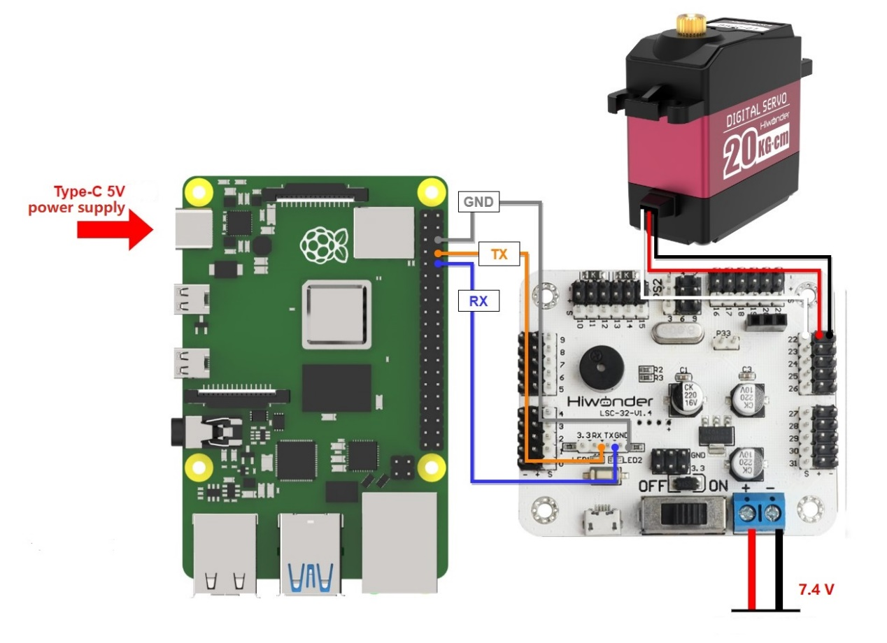
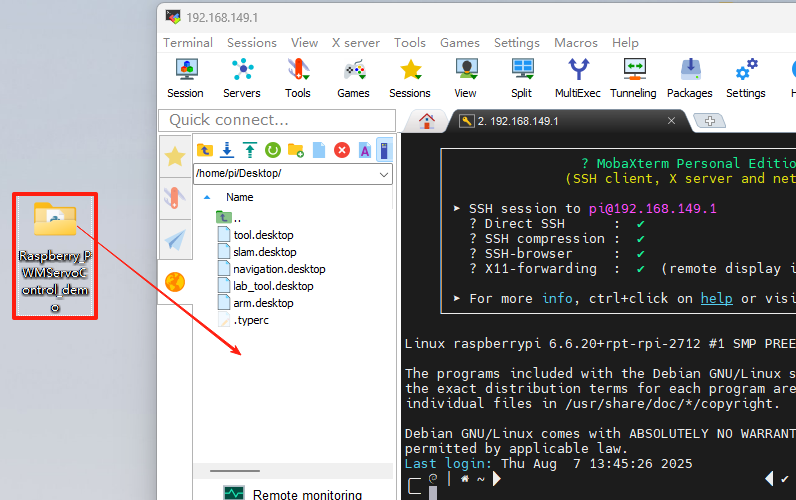

# 6.LSC-32 Controller Secondary Development-Raspberry Pi Development

## 6.1 Getting Started

### 6.1.1 Wiring Instruction

This example uses an Raspberry Pi controller and a 32-ch servo controller, powered by a 7.4V 6000mAh lithium battery for low-voltage servos. Connect the serial port of the 32-Channel Servo Controller to the serial port of the Raspberry Pi controller.



:::{Note}
* When using Hiwonder's lithium battery, connect the battery cable with the red wire to the positive (+) terminal and the black wire to the negative (–) terminal of the DC port.
* Before connecting the battery cables, make sure they are not already attached to the lithium battery. This prevents the risk of a short circuit caused by accidental contact between the positive and negative wires.
* When connecting the serial ports, make sure to cross the RX and TX pins.
:::

### 6.1.2 Environment Configuration

Install VNC software on PC. The software package is stored in [Appendix ->Remote Connection Software (for Raspberry Pi)](). For the detailed operations of VNC, please refer to the relevant tutorials.

Drag the program and library file SDK into the Raspberry Pi system image via MobaXterm. The software package is located under [Appendix ->Remote Connection Software (for Raspberry Pi)]().. For detailed instructions on how to use MobaXterm, refer to the corresponding document. In this example, the files are placed on the desktop. 

:::{Note}

Make sure the library files are placed in the same directory as the program.

:::



Open the command-line terminal and enter the following command to add execution permissions:

```bash
sudo chmod a+x Raspberry_PWMServoControl_demo/
```

## 6.2 Development Case

### 6.2.1 Case 1 Control a Single Servo

In this example, the serial port is used to send instructions to the 32-ch servo controller, which then controls the servo to move.

* **Run Program**

(1) Open a new terminal and enter the following command to navigate to the program directory:

```bash
cd Raspberry_PWMServoControl_demo/
```

(2) Run the program by entering:

```bash
python3 PWMServoControl.py
```

* **Project Outcome**

After running the program, the servo will continuously swing back and forth between position 500 and position 2500, with a 2-second interval.

* **Program Brief Analysis**

[Source Code]()

(1) Import Necessary Libraries

{lineno-start=}

```
import ServoControl
import time 
```
The library includes the necessary modules for communicating with the servo controller. You can use the predefined variables and functions in it to control the servo. In the `ServoControl` library file, the main method called is `setPWMServoMove()`.

{lineno-start=13}

```

def setBusServoMove(servo_id, servo_pulse, time):
    buf = bytearray(b'\x55\x55')   
    buf.append(0x08)  
    buf.append(LOBOT_CMD_SERVO_MOVE)  
    buf.append(0x01)  
    
    time = 0 if time < 0 else time
    time = 30000 if time > 30000 else time
    time_list = list(time.to_bytes(2, 'little'))     
    buf.append(time_list[0])
    buf.append(time_list[1])    

    servo_id = 254 if (servo_id < 1 or servo_id > 254) else servo_id
    buf.append(servo_id) #id
    
    servo_pulse = 0 if servo_pulse < 0 else servo_pulse
    servo_pulse = 1000 if servo_pulse > 1000 else servo_pulse
    pulse_list = list(servo_pulse.to_bytes(2, 'little'))    #
    buf.append(pulse_list[0])
    buf.append(pulse_list[1])     

    serialHandle.write(buf)
```
According to the communication protocol, the frame header, data length, command, and the number of servos to be controlled are first sent to the serial port.

{lineno-start=39}

```
    buf = bytearray(b'\x55\x55')  
    buf.append(0x08)  
    buf.append(LOBOT_CMD_SERVO_MOVE)  
    buf.append(0x01)  
```
Next, the time parameter passed in is filtered to ensure it falls within the range of (0, 30000). Values outside this range are clamped to 0 and 30000, respectively. This ensures that after the data is sent over the serial port, the controller can correctly recognize it. Then, the time parameter is split into high and low bytes using `list()`, where `'little'` indicates low byte first. These two bytes are then sent to the serial port.

{lineno-start=44}

```
    time = 0 if time < 0 else time
    time = 30000 if time > 30000 else time
    time_list = list(time.to_bytes(2, 'little'))     
    buf.append(time_list[0])
    buf.append(time_list[1])  
```
After that, the ID and position values are also filtered. If the incoming ID is less than 1 or greater than 254, it is clamped to 1 or 254, respectively. The position value is handled similarly: values below 0 are set to 0. Then, send the servo rotation position to the serial port in the form of two bytes.

{lineno-start=50}

```
    servo_id = 254 if (servo_id < 1 or servo_id > 254) else servo_id
    buf.append(servo_id) #舵机ID
    
    servo_pulse = 500 if servo_pulse < 500 else servo_pulse
    servo_pulse = 2500 if servo_pulse > 2500 else servo_pulse
    pulse_list = list(servo_pulse.to_bytes(2, 'little'))    #位置
    buf.append(pulse_list[0])
    buf.append(pulse_list[1])     

    serialHandle.write(buf)
```
Finally, the `buf` data is sent to the serial port using the `write()` method.

{lineno-start=59}

```
    serialHandle.write(buf)
```
(2) UART Initialization

{lineno-start=11}

```
serialHandle = serial.Serial("/dev/ttyAMA0", 9600)
```
Create an instance of the servo control object and set the baud rate to 9600.

(3) Control Servo Movement

{lineno-start=4}

```
if __name__ == '__main__': 
    while True:
        ServoControl.setPWMServoMove(1, 500, 1000)
        time.sleep(2)
        ServoControl.setPWMServoMove(1, 2500, 1000)
        time.sleep(2)
```
After the main program runs in `PWMServoControl`, it calls the `setPWMServoMove()` function to control Servo ID 1 to move from position 500 to 2500.

### 6.2.2 Case 2 Control a Single Servo’s Speed

In this example, the serial port is used to send instructions to the 32-ch servo controller, which then controls the servo to move.

* **Run Program**

(1) Open a new terminal and enter the following command to navigate to the program directory:

```bash
cd Raspberry_PWMServoControl_demo/
```

(2) Run the program by entering:

```bash
python3 PWMServoSpeed.py
```

* **Project Outcome**

After the program runs, the servo rotates to position 500 at a speed of 1200 ms, then moves from position 500 to position 2500. It then rotates back from position 2500 to position 500 and then to position 2500 again at a speed of 400 ms.

* **Program Brief Analysis**

[Source Code]()

(1) Import Necessary Libraries

{lineno-start=1}

```
import ServoControl
import time
```
The library includes the necessary modules for communicating with the 32-ch servo controller. You can use the predefined variables and functions in it to control the servo. In the `ServoControl` library, the main method used is `setPWMServoMove()`, which changes the servo speed by adjusting the movement duration.

(2) UART Initialization

{lineno-start=11}

```
serialHandle = serial.Serial("/dev/ttyAMA0", 9600)   
```
Create an instance of the servo control object and set the baud rate to 9600.

(3) Control Servo Movement

{lineno-start=4}

```
if __name__ == '__main__': 
    while True:
        ServoControl.setPWMServoMove(1, 500, 1200)
        time.sleep(2)
        ServoControl.setPWMServoMove(1, 2500, 1200)
        time.sleep(2)
        ServoControl.setPWMServoMove(1, 500, 400)
        time.sleep(1)
        ServoControl.setPWMServoMove(1, 2500, 400)
        time.sleep(1)
```
In the main program of `PWMServoControl`, the `setPWMServoMove()` function is first called to move Servo ID 1 from position 500 to 2500 over 1200 ms. Then, Servo ID 1 is moved back from position 2500 to 500 over 400 ms. When the rotation angle is the same, a shorter duration results in a higher speed.

### 6.2.3 Case 3 Control Multiple Servos

In this example, the serial port is used to send instructions to the 32-ch servo controller, which then controls multiple servos to move.

* **Run Program**

(1) Open a new terminal and enter the following command to navigate to the program directory:

```bash
cd Raspberry_PWMServoControl_demo/
```

(2) Run the program by entering:

```bash
python3 PWMServoMoveByArray.py
```

* **Project Outcome**

After running the program, Servo 1 and Servo 2 will move back and forth between position 500 and position 2500, with an interval of 1.5 seconds. The number of servos you can control depends on the available ports on the controller. In this example, only two servos are used, but you can modify the code to control more servos.

* **Program Brief Analysis**

[Source Code]()

(1) Import Necessary Libraries

{lineno-start=1}

```
import ServoControl
import time
```
The library includes the necessary modules for communicating with the 32-ch servo controller. You can use the predefined variables and functions in it to control the servo. In this example, the `setMorePWMServoMove()` method is mainly used to control multiple servos.

{lineno-start=37}

```
 
def setPWMServoMove(servo_id, servo_pulse, time):
    buf = bytearray(b'\x55\x55')   
    buf.append(0x08)  
    buf.append(LOBOT_CMD_SERVO_MOVE)  
    buf.append(0x01)  
    
    time = 0 if time < 0 else time
    time = 30000 if time > 30000 else time
    time_list = list(time.to_bytes(2, 'little'))    
    buf.append(time_list[0])
    buf.append(time_list[1])    

    servo_id = 254 if (servo_id < 1 or servo_id > 254) else servo_id
    buf.append(servo_id)   
    
    servo_pulse = 500 if servo_pulse < 500 else servo_pulse
    servo_pulse = 2500 if servo_pulse > 2500 else servo_pulse
    pulse_list = list(servo_pulse.to_bytes(2, 'little'))     
    buf.append(pulse_list[0])
    buf.append(pulse_list[1])     

    serialHandle.write(buf)
```
According to the communication protocol, the frame header, data length, command, and the number of servos to be controlled are first sent to the serial port.

{lineno-start=63}

```
    buf = bytearray(b'\x55\x55')   
    buf.append(servos_count*3+5)  
    buf.append(LOBOT_CMD_SERVO_MOVE)  
```
Exception filtering for servo count and rotation time is performed to ensure that the 32-ch servo controller can correctly recognize the data sent via the serial port.

{lineno-start=67}

```
    servos_count = 1 if servos_count < 1 else servos_count
    servos_count = 254 if servos_count > 254 else servos_count
    buf.append(servos_count) #要控制的舵机个数
    
    time = 0 if time < 0 else time
    time = 30000 if time > 30000 else time
    time_list = list(time.to_bytes(2, 'little'))
    buf.append(time_list[0])    #时间
    buf.append(time_list[1])
```
A for loop is used to send data from the servos list to the serial port. Set every two elements as one group: the first element is the servo ID, and the second is the target position. For example: `list = [1, 500, 2, 300]` means that servo ID 1 will move to position 500, and servo ID 2 will move to position 300. Finally, the `buf` data is sent to the serial port using the `write()` method.

{lineno-start=77}

```
    for i in range(servos_count):
        buf.append(servos[i*2])  #舵机ID
        pos = servos[i*2+1]
        pos = 0 if pos < 0 else pos
        pos = 1000 if pos > 1000 else pos
        pos_list = list(pos.to_bytes(2, 'little'))
        buf.append(pos_list[0])    #位置
        buf.append(pos_list[1])

    serialHandle.write(buf)
```
(2) UART Initialization

{lineno-start=11}

```
serialHandle = serial.Serial("/dev/ttyAMA0", 9600)  
```


Create an instance of the servo control object and set the baud rate to 9600.

(3) Control Servo Movement

{lineno-start=4}

```
if __name__ == '__main__': 
    while True:
        servos = [1, 2500, 2, 500]
        ServoControl.setPWMServoMoveByArray(servos, 2, 1000)
        time.sleep(2)
        servos = [1, 500, 2, 2500]
        ServoControl.setPWMServoMoveByArray(servos, 2, 1000)
        time.sleep(2)
```
In the main program of `PWMServoControl`, a servos queue is first created to set servo ID 1 to position 2500 and servo ID 2 to position 500. Then, the `setPWMServoMoreByarray()` function is called to move these two servos to their target positions within 1000 ms. After a 2-second delay, servo ID 1 is set to position 500 and servo ID 2 to position 2500. Then, the `setPWMServoMoreByArray()` function is called again to move the servos, also with a duration of 1000 ms.

### 6.2.4 Case 4 Central Position & Deviation Adjustment

In this example, the serial port is used to send instructions to the 32-ch servo controller, which then controls the servo to move to central position and deviation position.

The central position is considered the initial position of the servo and serves as the zero point for rotating in both positive and negative directions. Therefore, the servo should be adjusted to its central position before attaching the servo horn.

Servo deviation is caused by the gap generated when the servo’s main shaft meshes with the gear of the servo horn or arm. This mechanical error can be adjusted through software calibration. In robotics, if this deviation is not addressed, it may restrict the movement of the robot and negatively impact certain motion behaviors.

* **Run Program**

(1) Open a new terminal and enter the following command to navigate to the program directory:

```bash
cd Raspberry_PWMServoControl_demo/
```

(2) Run the program by entering:

```bash
python3 PWMServoMedAndBias.py
```

* **Project Outcome**

The servo first returns to the central position. After a short delay, it rotates to the specified deviation angle and holds that position.

* **Program Brief Analysis**

[Source Code]()

(1) Import Necessary Libraries

{lineno-start=1}

```
import time
import serial
```
The library includes the necessary modules for communicating with the 32-ch servo controller. You can use the predefined variables and functions in it to control the servo. In the `ServoControl` library file, the main method called is `setPWMServoMove()`.

(2) UART Initialization

{lineno-start=11}

```
serialHandle = serial.Serial("/dev/ttyAMA0", 9600)
```
Create an instance of the servo control object and set the baud rate to 9600.

(3) Control Servo Movement

{lineno-start=4}

```
if __name__ == '__main__': 
    deviation = 80
    ServoControl.setPWMServoMove(1, 1500, 800)
    time.sleep(2)
    ServoControl.setPWMServoMove(1, 1500+deviation, 800)
    while True:
        time.sleep(1)
```
In the main program of `PWMServoMedAndBias`, a variable named `deviation` is first created to store the deviation value. The `setPWMServoMove()` function is initially called to move servo ID 1 to position 1500 within 800 ms. After a 2-second delay, the servo is moved again based on its previous position (1500) plus the deviation value, thereby achieving a software-based deviation adjustment.